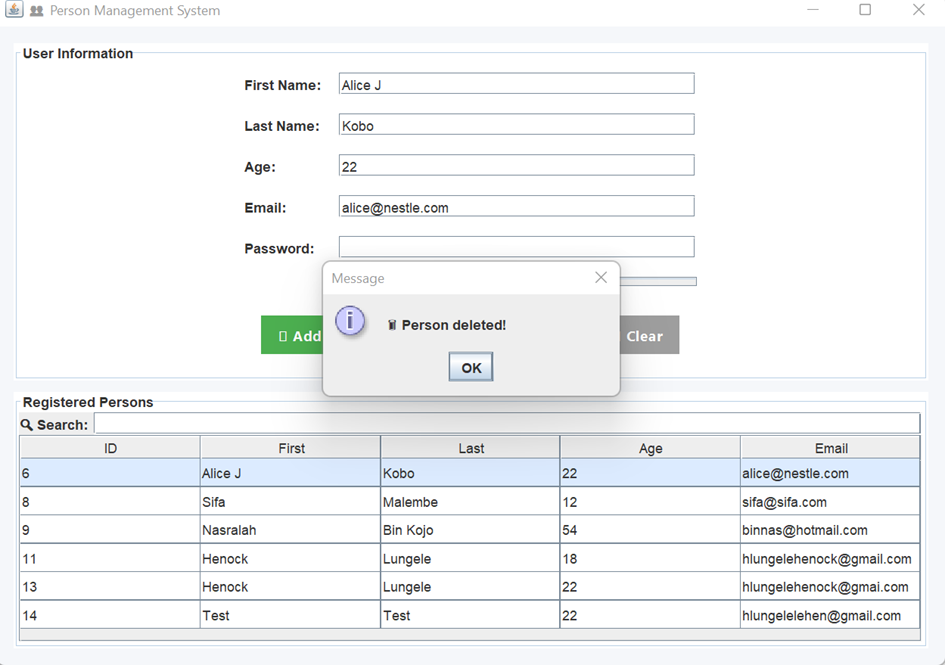
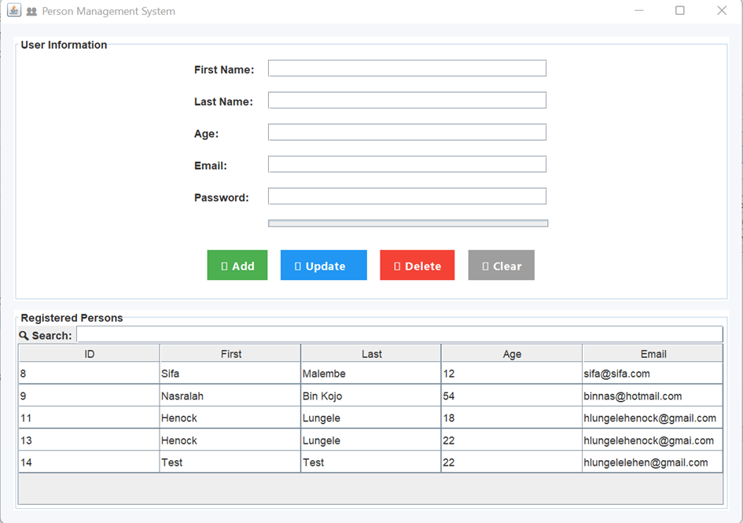
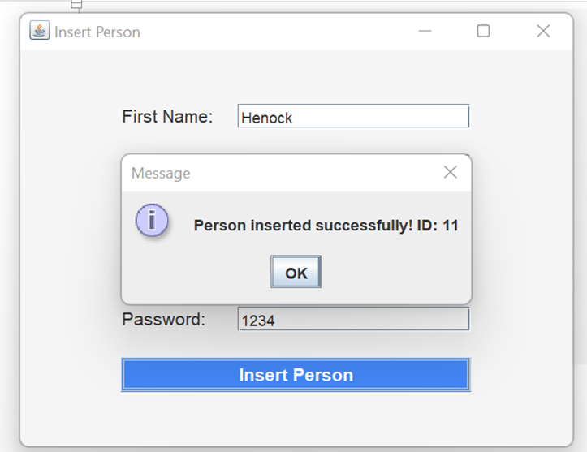

# 🎯 Projet Gestion de Personnes - Java

[](https://www.oracle.com/java/)
[](https://www.mysql.com/)
[](https://junit.org/junit5/)

Une application Java pour **gérer des personnes** avec une base de données MySQL, des interfaces graphiques **Swing** et des tests unitaires avec **JUnit 5**.

---

## 🔹 Table des matières
1. [Importation du projet](#-importation-du-projet)
2. [Installation des dépendances](#-installation-des-dépendances)
3. [Configuration de la base de données](#-onfiguration-de-la-base-de-données)
4. [Interface graphique](#-interface-graphique)
5. [Tests unitaires](#-tests-unitaires)
6. [Git et déploiement sur GitHub](#-git-et-déploiement-sur-github)
7. [Résumé](#-résumé)
8. [Screenshots](#-screenshots)
9. [Ressources](#-bibliographie)
10. [Livres](#-livres)

---

## 🔹 Importation du projet

Pour importer le projet Eclipse dans IntelliJ :

1. **Ouvrir le projet** dans IntelliJ IDEA.
2. Aller dans **File → Project Structure**.
3. Ajouter la **structure** et préciser que le dossier `src` est **le dossier compilé**.

---

## 🔹 Installation des dépendances

### 1️⃣ JUnit
- Méthode 1 : télécharger les fichiers `.jar` et les ajouter dans les dépendances.
- Méthode 2 : cliquer sur `@Test` souligné en rouge → `Add JUnit 5.8 to Libraries`.

### 2️⃣ MySQL Connector
- Télécharger le fichier `.jar` du connecteur MySQL.
- L’ajouter dans les **dépendances du projet**.

**Liste finale des dépendances :**
- JUnit 5
- MySQL Connector/J
- Hamcrest (pour les assertions dans les tests)

---

## 🔹 Configuration de la base de données

1. Installer et ouvrir **XAMPP**.
2. Accéder à **PHPMyAdmin**.
3. Créer la base : `gestion_person`.
4. Créer la table `person` :

```sql
CREATE TABLE person (
    id INT AUTO_INCREMENT PRIMARY KEY,
    firstname VARCHAR(50) NOT NULL,
    lastname VARCHAR(50) NOT NULL,
    age INT NOT NULL,
    email VARCHAR(100) UNIQUE NOT NULL,
    password VARCHAR(100) NOT NULL
);
```

## 🔹 Interface graphique

L’application propose deux interfaces graphiques principales, créées avec **Java Swing**, faciles à utiliser et sans configuration complexe.

### 1️⃣ Formulaire d’insertion de personne

Cette interface permet d’ajouter une personne dans la base de données via un **formulaire simple**.  

**Caractéristiques :**
- Champs : **Prénom, Nom, Âge, Email, Mot de passe**  
- Bouton : **Insert Person** pour envoyer les données  
- Messages interactifs : succès ou erreur d’insertion  

**Fonctionnement :**
1. L’utilisateur saisit les informations dans les champs.  
2. Lorsqu’il clique sur le bouton, les données sont envoyées à **PersonService**, qui utilise **MySQLPersonDAO** pour les insérer dans la base.  
3. Une boîte de dialogue informe de la réussite ou des erreurs (ex. âge invalide ou email existant).  

**Exemple de code :**
```java
Person person = new Person(first, last, age, email, password);
service.create(person);
```
## 🔹 Tests unitaires

L’application utilise **JUnit 5** pour tester le bon fonctionnement des fonctionnalités principales, notamment l’insertion, la modification, la suppression et l’authentification des personnes.

### 1️⃣ Structure des tests

- Les tests sont placés dans le dossier `test`.
- Une classe principale de test : `PersonServiceTest.java`
- Chaque méthode de service possède ses propres tests pour garantir le comportement attendu.

### 2️⃣ Initialisation

Avant de lancer les tests, les variables nécessaires sont initialisées avec l’annotation `@BeforeAll` :

```java
@BeforeAll
static void setup() throws ClassNotFoundException, SQLException {
    dao = new MySQLPersonDAO();
    service = new PersonService(dao);
}
```
### 3. Test si tout est valide
```java
  @Test
    @Order(1)
    void testAuthenticateSuccess() throws SQLException {
        Person person = service.authenticate("alice@nestle.com", "P@ssword");
        assertNotNull(person);
        assertEquals("Alice", person.getFirstName());
    }
```

### 4. Autres tests
```java
 @Test
    @Order(2)
    void testAuthenticateWrongPassword() {
        Exception exception = assertThrows(IllegalArgumentException.class, () -> {
            service.authenticate("alice@nestle.com", "wrongpass");
        });
        assertEquals("Invalid password", exception.getMessage());
    }

    @Test
    @Order(3)
    void testAuthenticateUnknownEmail() {
        Exception exception = assertThrows(IllegalArgumentException.class, () -> {
            service.authenticate("unknown@mail.com", "pwd");
        });
        assertEquals("Email not found", exception.getMessage());
    }
```

## 🔹 Git et déploiement sur GitHub
Normalement on devrait : 
- Créer un dépôt sur github
- Initialiser le projet
- Configurer l'origine du dépôt
- faire les push

Avec **intelliJ** il faut localiser le buton Alt+9, configurer le projet, 
s'authentifier et publier son projet comme vous allez le voir dans les camptures concernant les 
notes de ce projet.

## 🔹 Résumé
Le **Projet Gestion de Personnes** est une application Java permettant de gérer des informations personnelles via une base de données **MySQL**. Il inclut :

- **Insertion, modification, suppression et consultation** des personnes.
- Une **interface graphique Swing** simple et intuitive pour ajouter ou se connecter.
- Un **système d’authentification** sécurisé par email et mot de passe.
- Des **tests unitaires JUnit 5** garantissant le bon fonctionnement des fonctionnalités principales.
- Une architecture basée sur le **pattern DAO/Service**, assurant la séparation entre la logique métier et l’accès aux données.

Le projet a été conçu pour être facilement importé dans **IntelliJ**, avec toutes les dépendances nécessaires (MySQL Connector, JUnit) et offre une expérience utilisateur claire sans configuration complexe

## 🔹 screenshots
**connexion**


**Connection success**


**Insertion succeed**


---

## 📖 Bibliographie

1. **Oracle Java Documentation** – [https://docs.oracle.com/javase/](https://docs.oracle.com/javase/)
2. **MySQL Documentation** – [https://dev.mysql.com/doc/](https://dev.mysql.com/doc/)
3. **JUnit 5 User Guide** – [https://junit.org/junit5/docs/current/user-guide/](https://junit.org/junit5/docs/current/user-guide/)
4. **Swing Tutorial – Oracle** – [https://docs.oracle.com/javase/tutorial/uiswing/](https://docs.oracle.com/javase/tutorial/uiswing/)
5. **IntelliJ IDEA Guide** – [https://www.jetbrains.com/idea/guide/](https://www.jetbrains.com/idea/guide/)
6. **GitHub Docs – Working with Markdown** – [https://docs.github.com/en/get-started/writing-on-github](https://docs.github.com/en/get-started/writing-on-github)

## 📚 Livres

- **Oracle (2024).** *Java Platform, Standard Edition Documentation.*  
  Disponible sur : [https://docs.oracle.com/javase/](https://docs.oracle.com/javase/)

- **MySQL (2024).** *MySQL Reference Manual.*  
  Disponible sur : [https://dev.mysql.com/doc/](https://dev.mysql.com/doc/)

- **JUnit Team (2023).** *JUnit 5 User Guide.*  
  Disponible sur : [https://junit.org/junit5/docs/current/user-guide/](https://junit.org/junit5/docs/current/user-guide/)

- **JetBrains (2024).** *IntelliJ IDEA User Guide.*  
  Disponible sur : [https://www.jetbrains.com/idea/guide/](https://www.jetbrains.com/idea/guide/)


